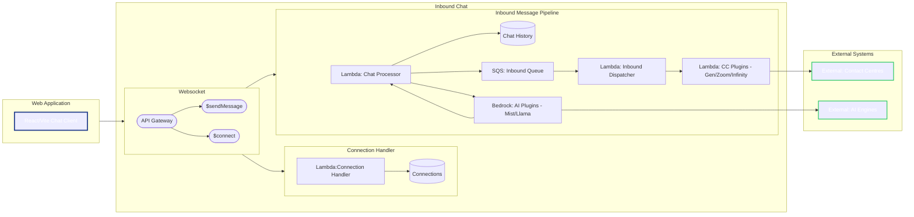

```mermaid

flowchart RL
    classDef external stroke:#22c55e,stroke-width:2px,color:#ffffff;
    classDef webapp stroke:#1e3a8a,stroke-width:3px,color:#ffffff;

    subgraph OC [Outbound Chat]
        direction RL
        OBP
        OBD
        API_REST
        API_WS
    end

    subgraph OBP [Outbound Pipeline]
        direction RL
        OutboundQueue[SQS: Outbound Queue]
        DispatcherQueue[SQS: Dispatcher Queue]
        OutboundProcessor[Lambda: Outbound Processor]
        CCAdapter[Lambda: CCAdapter - Gen/Zoom/Infinity] 
        ChatTable[(Chat History)]
    end

    subgraph OBD [Outbound Dispatcher]
        direction RL
        Dispatcher[Lambda: Outbound Dispatcher]
    end

    subgraph OBCC [Contact Centres]
        direction RL
        CC[External: Contact Centres]:::external
    end

    subgraph API_WS [Websocket]
        direction RL
        APIGW_WS([API Gateway])
        CHAT([$sendMessage])
    end

    subgraph API_REST [REST]
        APIGW([API Gateway/POST])      
    end
    
    subgraph FE [Web Application]
        UI[React/Vite Chat Client]:::webapp
    end

    CC --> APIGW
    APIGW --> CCAdapter
    CCAdapter --> OutboundQueue
    OutboundQueue --> OutboundProcessor
    OutboundProcessor --> DispatcherQueue
    OutboundProcessor --> ChatTable
    DispatcherQueue --> Dispatcher
    Dispatcher --> APIGW_WS
    APIGW_WS --> CHAT
    CHAT --> UI